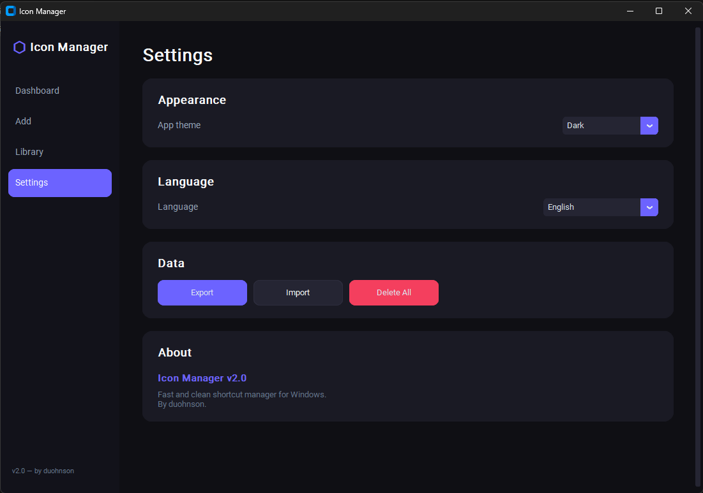
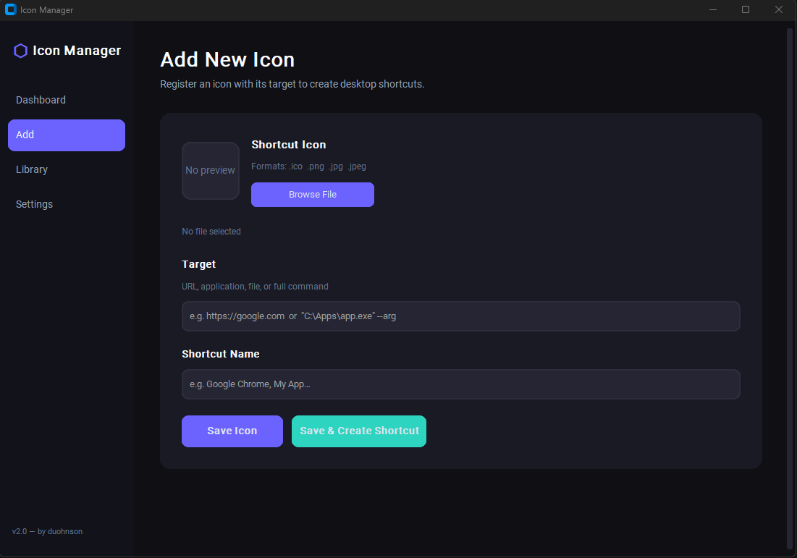

# Icon Manager

A fast, clean shortcut manager for Windows. Built because I got tired of manually creating 8+ desktop shortcuts every time I set up a new machine at work.

## What it does

- Creates desktop shortcuts with custom icons, names, and targets (URLs, apps, files, full commands)
- Auto-converts `.png`, `.jpg`, `.jpeg` images to `.ico` with multiple resolutions
- Stores everything in a portable folder next to the executable — works from USB drives
- Dark/light theme support, export/import backups, batch operations

## How it works

### Dashboard
Overview of stored icons, quick actions, and recent entries.

### Add
Pick an icon image, set the target (URL, app path, or a full command like `"C:\Program Files\Edge\msedge.exe" https://google.com`), give it a name, and save. The app handles executable + arguments splitting automatically.

### Library
Grid of icon cards with live search. Select multiple icons and create shortcuts in batch, or create/delete individually.

### Settings
Theme picker (dark, light, system), export/import data as JSON, nuke all stored data.

## Setup

```bash
git clone https://github.com/duohnson/icon-manager
cd icon-manager
pip install -r requirements.txt
```

On Windows, also install:
```bash
pip install pywin32 winshell comtypes
```

## Building the .exe

```bash
pip install pyinstaller
pyinstaller --onefile --windowed --icon=icon.ico --hidden-import=customtkinter --hidden-import=PIL icon_manager.py
```

Or use the included spec file:
```bash
pyinstaller build_script.spec
```

## Screenshots




---

Questions or feedback? Find me on [GitHub](https://github.com/duohnson).

